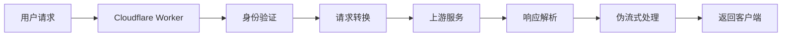

# 🚀 PerfectAssistant-2API Cloudflare Worker

<div align="center">

   

**✨ 将 [perfectassistant.ai](https://perfectassistant.ai) 的免费 AI 服务转换为高性能 OpenAI 兼容 API 的魔法转换器！**

*"让每个人都能轻松访问 AI 能力，就像呼吸一样简单"* 🌬️

</div>

## 📖 目录
- [🎯 项目简介](#-项目简介)
- [🌟 核心特性](#-核心特性)
- [⚡ 快速开始](#-快速开始)
- [🔧 详细教程](#-详细教程)
- [🎨 技术原理](#-技术原理)
- [🏗️ 项目架构](#️-项目架构)
- [🚀 使用场景](#-使用场景)
- [📊 项目现状](#-项目现状)
- [🔮 未来规划](#-未来规划)
- [🛠️ 技术细节](#️-技术细节)
- [🤝 贡献指南](#-贡献指南)
- [📄 开源协议](#-开源协议)

## 🎯 项目简介

### 这是什么？🤔
这是一个**单文件**的 Cloudflare Worker，它像一个"魔法翻译官"🧙‍♂️，把 [perfectassistant.ai](https://perfectassistant.ai) 的免费 AI 服务变成了标准的 **OpenAI API 格式**！

### 为什么需要它？💡
- **免费使用** 🆓：基于免费的 perfectassistant.ai 服务
- **OpenAI 兼容** 🤖：直接使用现有的 OpenAI SDK 和工具
- **伪流式响应** ⚡：即使上游不支持流式，我们也模拟出流畅的打字机效果
- **一键部署** 🚀：无需复杂配置，5分钟即可上线

### 哲学理念 🧠
> "技术应该服务于人，而不是让人服务于技术。我们致力于降低 AI 的使用门槛，让创意和想法能够自由流动。"

## 🌟 核心特性

| 特性 | 描述 | 状态 |
|------|------|------|
| 🎯 **OpenAI 兼容** | 完全兼容 OpenAI API 规范 | ✅ 已完成 |
| ⚡ **伪流式响应** | 智能模拟 SSE 流式响应 | ✅ 已完成 |
| 🛡️ **CORS 支持** | 跨域请求支持 | ✅ 已完成 |
| 🎨 **开发者UI** | 内置全功能测试界面 | ✅ 已完成 |
| 🔐 **身份验证** | Bearer Token 认证 | ✅ 已完成 |
| 📚 **多模型** | 支持6种不同的AI模型 | ✅ 已完成 |
| 🚀 **高性能** | Cloudflare Edge 网络 | ✅ 已完成 |

## ⚡ 快速开始

### 🎯 懒人一键部署（30秒搞定！）

[](https://deploy.workers.cloudflare.com/?url=https://github.com/jiam9069/perfectassistant-2api-cfwork)

1. **点击上面按钮** 🔼
2. **登录 Cloudflare 账号** 🔑
3. **设置项目名称** 📛
4. **部署完成！** 🎉

### 📋 手动部署（3分钟）

```bash
# 1. 克隆项目
git clone https://github.com/jiam9069/perfectassistant-2api-cfwork.git
cd perfectassistant-2api-cfwork

# 2. 安装 Wrangler CLI
npm install -g wrangler

# 3. 登录 Cloudflare
wrangler login

# 4. 部署！
wrangler deploy
```

### 🎮 立即使用

部署完成后，访问你的 Worker 地址，你会看到：


## 🔧 详细教程

### 对于开发者 🧑‍💻

#### Python 使用示例

```python
import openai

# 配置客户端
client = openai.OpenAI(
    base_url="https://your-worker.your-account.workers.dev/v1",
    api_key="1"  # 默认密钥，可在环境变量修改
)

# 流式对话
response = client.chat.completions.create(
    model="brainstorm-tool",  # 使用头脑风暴模型
    messages=[{"role": "user", "content": "帮我写一个关于环保的博客大纲"}],
    stream=True
)

for chunk in response:
    content = chunk.choices[0].delta.content
    if content:
        print(content, end="", flush=True)
```

#### JavaScript 使用示例

```javascript
const response = await fetch('https://your-worker.your-account.workers.dev/v1/chat/completions', {
    method: 'POST',
    headers: {
        'Content-Type': 'application/json',
        'Authorization': 'Bearer 1'
    },
    body: JSON.stringify({
        model: 'brainstorm-tool',
        messages: [{ role: 'user', content: 'Hello!' }],
        stream: true
    })
});

// 处理流式响应
const reader = response.body.getReader();
while (true) {
    const { done, value } = await reader.read();
    if (done) break;
    console.log(new TextDecoder().decode(value));
}
```

### 对于小白用户 👶

#### 什么是 API？🤔
> API 就像餐厅的服务员👨‍🍳：你告诉他想要什么（点菜），他帮你跟厨房沟通，然后把做好的菜端给你。

#### 这个项目能帮你做什么？🎯
- **写文章** 📝：博客、邮件、作文
- **头脑风暴** 💡：创意想法、方案规划
- **学习助手** 🎓：解答问题、整理知识点
- **内容创作** 🎨：社交媒体文案、广告语

## 🎨 技术原理

### 🔄 核心工作流程



### 🧩 伪流式技术详解

**问题**：上游服务一次性返回完整响应，但用户想要"打字机"效果。

**解决方案**：智能分块 + 延迟发送 = 伪流式体验！🎪

```javascript
// 核心伪流式代码
for (let i = 0; i < content.length; i += chunkSize) {
    const chunkContent = content.slice(i, i + chunkSize);
    // 发送数据块
    await writer.write(encoder.encode(`data: ${JSON.stringify(chunk)}\n\n`));
    // 添加人性化延迟
    await new Promise(r => setTimeout(r, delay));
}
```

### 🎯 关键技术点

| 技术点 | 作用 | 实现方式 |
|--------|------|----------|
| **TransformStream** | 流式数据处理 | JavaScript 内置API |
| **SSE** | 服务器推送事件 | `text/event-stream` 格式 |
| **CORS** | 跨域资源共享 | 自动添加响应头 |
| **UUID生成** | 会话管理 | `crypto.randomUUID()` |

## 🏗️ 项目架构

### 📁 文件结构

```
perfectassistant-2api-cfwork/
├── 📄 README.md                    # 项目文档 (你正在看的!)
├── 🚀 worker.js                    # 核心 Worker 代码 (单文件!)
├── 📋 package.json                 # 项目配置
├── 🔧 wrangler.toml                # Cloudflare 配置
├── 📝 LICENSE                      # Apache 2.0 协议
└── 🎨 assets/                      # 资源文件
    └── screenshot.png              # 项目截图
```

### 🧩 代码模块结构

```javascript
// ============ [第一部分: 核心配置] ============
const CONFIG = {
    // 项目元数据、安全配置、上游服务配置等
};

// ============ [第二部分: Worker 入口与路由] ============
export default {
    async fetch(request, env, ctx) {
        // 路由分发逻辑
    }
};

// ============ [第三部分: API 代理逻辑] ============
async function handleChatCompletions(request, apiKey) {
    // 核心业务逻辑
}

// ============ [第四部分: 开发者驾驶舱 UI] ============
function handleUI(request, apiKey) {
    // 漂亮的Web界面
}
```

## 🚀 使用场景

### 🎯 适用人群

| 用户类型 | 使用场景 | 收益 |
|----------|----------|------|
| **开发者** | 快速原型开发、测试AI应用 | 节省API费用，快速验证想法 |
| **学生** | 学习编程、完成作业 | 免费的AI助手，学习伴侣 |
| **创作者** | 内容创作、文案写作 | 灵感源泉，写作助手 |
| **创业者** | 产品MVP开发 | 低成本验证产品概念 |

### 💼 业务场景

1. **教育领域** 🎓：智能辅导、作业帮助
2. **内容创作** ✍️：自动生成文章、社交媒体内容
3. **客户服务** 🤖：智能客服原型开发
4. **个人助手** 🧠：日常问题解答、学习陪伴

## 📊 项目现状

### ✅ 已完成功能

- [x] **核心API代理**：完整 OpenAI 兼容接口
- [x] **伪流式响应**：流畅的用户体验
- [x] **多模型支持**：6种不同的AI工具
- [x] **Web管理界面**：开发者友好UI
- [x] **安全认证**：Bearer Token 支持
- [x] **跨域支持**：完整的CORS处理
- [x] **错误处理**：完善的错误处理机制

### 🚧 待完善功能

- [ ] **速率限制**：防止API滥用
- [ ] **缓存机制**：提升响应速度
- [ ] **监控统计**：使用量统计和监控
- [ ] **更多模型**：扩展支持的AI模型
- [ ] **配置界面**：动态配置管理

## 🔮 未来规划

### 🎯 短期目标 (1-2个月)

1. **性能优化** ⚡：添加响应缓存，减少上游请求
2. **监控增强** 📊：添加使用统计和监控面板
3. **文档完善** 📚：更多使用示例和教程

### 🚀 中期目标 (3-6个月)

1. **多上游支持** 🌐：支持多个AI服务提供商
2. **插件系统** 🔌：可扩展的插件架构
3. **移动端适配** 📱：响应式移动端界面

### 🌟 长期愿景 (1年以上)

1. **生态系统** 🏘️：建立开发者生态系统
2. **企业版** 💼：企业级功能和支持
3. **开源社区** 👥：活跃的贡献者社区

## 🛠️ 技术细节

### 🔧 核心配置详解

```javascript
const CONFIG = {
    PROJECT_NAME: "perfectassistant-2api",     // 项目名称
    PROJECT_VERSION: "1.0.0",                  // 版本号
    API_MASTER_KEY: "1",                       // 默认API密钥
    
    // 上游服务配置
    UPSTREAM_URL: "https://perfectassistant.ai/ai/free",
    ORIGIN_URL: "https://perfectassistant.ai",
    
    // 用户代理伪装（避免被识别为机器人）
    USER_AGENT: "Mozilla/5.0 (Windows NT 10.0...)",
    
    // 支持的模型列表
    MODELS: [
        "brainstorm-tool",      // 头脑风暴
        "blog-post-generator",  // 博客生成
        // ... 更多模型
    ]
};
```

### 🎨 UI 组件设计

**设计理念**：暗色主题 + 现代化设计 = 开发者友好！🎨

```css
:root {
    --bg: #121212;          /* 深色背景 */
    --panel: #1E1E1E;       /* 面板颜色 */
    --primary: #FFBF00;     /* 主色调 - 活力黄 */
    --text: #E0E0E0;        /* 文本颜色 */
}
```

### ⚡ 性能优化策略

1. **边缘计算** 🏃：利用 Cloudflare 全球网络
2. **连接复用** 🔄：保持上游连接
3. **智能分块** 🧩：优化的流式分块策略
4. **延迟优化** ⏱️：人性化的响应延迟

## 🤝 贡献指南

### 🎯 如何贡献？

我们欢迎所有类型的贡献！🌟

1. **报告问题** 🐛：发现bug？告诉我们！
2. **功能建议** 💡：有好想法？分享出来！
3. **代码贡献** 👨‍💻：想写代码？欢迎PR！
4. **文档改进** 📚：改进文档？太棒了！
5. **宣传推广** 📢：喜欢项目？分享给朋友！

### 🔧 开发环境搭建

```bash
# 1. 克隆项目
git clone https://github.com/jiam9069/perfectassistant-2api-cfwork.git

# 2. 安装依赖
npm install

# 3. 本地开发
wrangler dev

# 4. 测试部署
wrangler deploy
```

### 📝 代码规范

- 使用 **清晰的变量名** 🎯
- 添加 **必要的注释** 📝
- 保持 **代码简洁** ✨
- 编写 **测试用例** 🧪

## 📄 开源协议

### Apache 2.0 协议 📜

本项目采用 **Apache 2.0** 开源协议，这意味着：

**你可以** ✅：
- 自由使用、修改、分发软件
- 将软件用于商业用途
- 申请专利授权

**你需要** 📋：
- 保留原始版权和协议声明
- 声明对源代码的修改
- 不使用商标标识

**你不需要** 🚫：
- 开源你的修改版本
- 提供技术支持

---

<div align="center">

## 🎉 感谢使用！

**如果这个项目对你有帮助，请给我们一个 ⭐ Star！** 

*让更多人发现这个有用的工具！*

---

**由 ❤️ 和 JavaScript 驱动**

*技术让世界更美好！*

</div>

---

## 📞 联系我们

- **GitHub**: [lza6/perfectassistant-2api-cfwork](https://github.com/jiam9069/perfectassistant-2api-cfwork)
- **问题反馈**: [GitHub Issues](https://github.com/jiam9069/perfectassistant-2api-cfwork/issues)
- **功能建议**: [GitHub Discussions](https://github.com/jiam9069/perfectassistant-2api-cfwork/discussions)

## 🗺️ 项目路线图

### 🎯 2025 Q1 目标
- [ ] 添加速率限制功能
- [ ] 实现响应缓存
- [ ] 完善错误处理机制

### 🚀 2025 Q2 目标  
- [ ] 支持更多 AI 服务提供商
- [ ] 开发配置管理界面
- [ ] 添加使用统计功能

### 🌟 2025 下半年
- [ ] 移动端应用开发
- [ ] 企业级功能开发
- [ ] 社区生态建设

---

<div align="center">

**✨ 星星之火，可以燎原 ✨**

*每一个小小的贡献，都能让开源世界变得更美好！*

</div>
